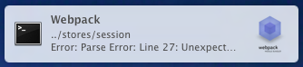

# webpack-notifier

[](https://www.npmjs.com/package/webpack-notifier)
[](https://github.com/Turbo87/webpack-notifier/actions?query=workflow:CI)
[](https://coveralls.io/github/Turbo87/webpack-notifier?branch=master)
[](https://github.com/airbnb/javascript)  
[](https://www.npmjs.com/package/webpack-notifier)


This is a [webpack](http://webpack.github.io/) plugin that uses the
[node-notifier](https://github.com/mikaelbr/node-notifier) package to
display build status system notifications to the user.



> This is a fork of the
[webpack-error-notification](https://github.com/vsolovyov/webpack-error-notification)
plugin. It adds support for Windows and there is no need to manually install
the `terminal-notifier` package on OS X anymore.

The plugin will notify you about the first run (success/fail),
all failed runs and the first successful run after recovering from
a build failure. In other words: it will stay silent if everything
is fine with your build.


## Installation

Use `npm` to install this package:

    npm install --save-dev webpack-notifier

Check the `node-notifier`
[Requirements](https://github.com/mikaelbr/node-notifier#requirements)
whether you need to install any additional tools for your OS.


## Usage

In the `webpack.config.js` file:

```js
var WebpackNotifierPlugin = require('webpack-notifier');

var config = module.exports = {
  // ...

  plugins: [
    new WebpackNotifierPlugin(),
  ]
}
```


## Configuration

### All `node-notifier` options

> **Deprecated since v1.17.** This way of passing options keeps working until
> v2.0 — use [`notifyOptions`](#notifyoptions) instead.

You can use any [node-notifier](https://www.npmjs.com/package/node-notifier) options (depending on your OS)
Except for options generated by the plugin itself:
* `title` - it can be not only a string, but also a function
* `message` - generated based on the value of other options
* `contentImage` - it can be an object with images for different statuses
* `icon` - matches with `contentImage`

### notifyOptions

> Since v1.17.

The recommended way to pass [node-notifier](https://www.npmjs.com/package/node-notifier) options (depending on your OS) on every notification:

```js
new WebpackNotifierPlugin({
  notifyOptions: {
    appID: 'com.squirrel.your.app', // Windows: use your app id instead of the default 'SnoreToast' one
  },
});
```

`notifyOptions` accepts any node-notifier option. The values for `title`,
`message`, `contentImage` and `icon` are always generated by the plugin, so
anything you set for them here is ignored — use the plugin-level
[`title`](#title) and [`contentImage`](#content-image) options instead.

### notifier / notifierOptions

> Since v1.17.

By default the plugin notifies through the `node-notifier` notifier selected for your OS.
Use `notifier` to pick another notifier and `notifierOptions` to configure its
constructor. `notifierOptions` without `notifier` configure the constructor of
the notifier selected for your OS:

```js
var nodeNotifier = require('node-notifier');

new WebpackNotifierPlugin({
  notifier: nodeNotifier.WindowsToaster, // or just 'WindowsToaster'
  notifierOptions: {
    withFallback: false, // do not fall back to balloon notifications
  },
});
```

`notifier` accepts the name of one of the notifiers exported by
[node-notifier](https://www.npmjs.com/package/node-notifier)
(`NotificationCenter`, `WindowsToaster`, `WindowsBalloon`, `Growl`, `NotifySend`)
or the constructor itself. `notifierOptions` are passed to the notifier
constructor — see the `node-notifier` documentation for the options supported
by each notifier (e.g. `withFallback`, `customPath`).

### Title

Title shown in the notification.

```js
new WebpackNotifierPlugin({title: 'Webpack'});
```

```js
new WebpackNotifierPlugin({title: function (params) {
  return `Build status is ${params.status} with message ${params.message}`;
}});
```

### Emojis in message text

Show status emoji icon before the message.

```js
new WebpackNotifierPlugin({emoji: true});
```

### Content Image

Image shown in the notification. Can be a path string or object with paths.

#### String path:
```js
var path = require('path');

new WebpackNotifierPlugin({contentImage: path.join(__dirname, 'logo.png')});
```

#### Object string path:
```js
var path = require('path');

const statusesPaths = {
  success: path.join(__dirname, 'success.png'),
  warning: path.join(__dirname, 'warning.png'),
  error: path.join(__dirname, 'error.png')
}

new WebpackNotifierPlugin({contentImage: statusesPaths});
```

### Exclude Warnings

If set to `true`, warnings will not cause a notification.

```js
new WebpackNotifierPlugin({excludeWarnings: true});
```

### Always Notify

Trigger a notification every time. Call it "noisy-mode".

```js
new WebpackNotifierPlugin({alwaysNotify: true});
```

### Notify on error

Trigger a notification only on error.

```js
new WebpackNotifierPlugin({onlyOnError: true});
```

### Skip Notification on the First Build

Do not notify on the first build.  This allows you to receive notifications on subsequent incremental builds without being notified on the initial build.

```js
new WebpackNotifierPlugin({skipFirstNotification: true});
```
